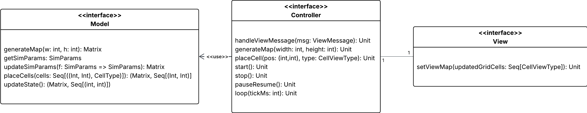

# Design Architetturale

## Architettura complessiva
Per strutturare il progetto in maniera ordinata e ridurre al minimo le dipendenze tra le varie parti, è stata adottata un'architettura basata sul modello MVC.
Questa scelta consente di realizzare un sistema flessibile, facilmente estendibile e in grado di adattarsi a scenari futuri.

Come mostrato in figura, le interfacce di `Model`, `View` e `Controller` permettono una separazione delle responsabilità, come segue:
- Model: viene interrogato dal controller e gestisce la logica della simulazione nella sua interezza
  - Generazione della mappa
  - Modello probabilistico nella distribuzione del fuoco
  - Comportamento degli agenti di contrasto
  - Controllo della correttezza nella richiesta di posizionare celle da parte dell'utente
- Controller: gestisce il loop della simulazione e collega view e model
  - Gestione dei tempi di simulazione
  - Conversione tra tipi di dati model e tipi di dati view
  - Interroga il model per:
    - Aggiornare parametri di simulazione
    - Richiedere i parametri aggiornati
    - Richiedere il numero di ciclo corrente
    - Piazzare celle
    - Aggiornare lo stato (i.e. far avanzare la simulazione)
  - Interroga la view per mostrare la mappa aggiornata
- View: si occupa della visualizzazione delle informazioni elaborate dal Model
  - Visualizzazione dei tipi di dati view ricevuti dal controller
  - Invio al controller di input ricevuti dall'utente
    - Modifica dei parametri
    - Personalizzazione della mappa
    - Modifica e controllo del tempo di simulazione (start, stop, pause/resume, velocità)

## Pattern architetturali

Il modello MVC permette di separare in modo netto la logica dei dati, la presentazione e il controllo del flusso.
Questa impostazione può introdurre rigidità e maggiore carico di gestione, ma porta con sé molteplici vantaggi:
- Consente una chiara distinzione tra logica applicativa, interfaccia e gestione degli eventi
- Favorisce il riuso e la modularità del codice
- Rende più agevole la manutenzione e gli aggiornamenti del sistema
- Le modifiche apportate a un modulo non si riflettono sugli altri
- L'utilizzo di un'architettura standard agevola programmatori esterni nella comprensione della codebase

[Indice](../index.md) |
[<](../2-requirements/index.md) |
[>](../4-design/index.md)
