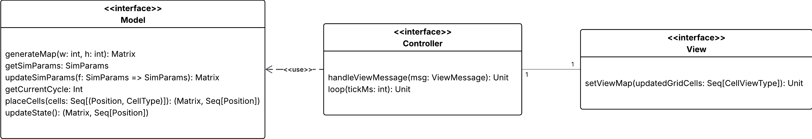

# Design Architetturale

## Architettura complessiva
Per strutturare il progetto in maniera ordinata e ridurre al minimo le dipendenze tra le varie parti, è stata adottata un'architettura basata sul modello MVC.
Questa scelta consente di realizzare un sistema flessibile, facilmente estendibile e in grado di adattarsi a scenari futuri.

Come mostrato in figura, è presente una separazione di responsabilità tra le principali classi, come segue:
- `SimModel` implementa `Model`
  - Utilizza `MapGeneration` per generare la mappa, di tipo `Matrix`
  - Mantiene aggiornati i `SimParams`
  - Interroga `FireSpread` e `FireFighter` per l'avanzamento della simulazione
  - Controlla la correttezza del posizionamento di celle da parte dell'utente
- `MapGeneration` genera una mappa verosimile di tipo `Matrix` con strategie più o meno complesse
- `FireFighter` gestisce il movimento di un vigile del fuoco, aggiornando il movimento e le azioni svolte dal vigile del fuoco, come spegnere celle infuocate o ricaricare 
- `FireSpread` si occupa della gestione dell'avanzamento del fuoco, andando a modificare o aggiornare le celle, come ad esempio trasformare le celle che stanno bruciando a celle bruciate.
- `SimController` implementa `Controller`
  - Gestione dei tempi di simulazione
  - Utilizza `CellTypeConverter` per la conversione tra tipi di celle model e tipi di celle view
  - Interroga il `SimModel` per:
    - Aggiornare parametri di simulazione
    - Richiedere i parametri aggiornati
    - Richiedere il numero di ciclo corrente
    - Piazzare celle al momento corretto per evitare inconsistenze
    - Aggiornare lo stato (i.e. far avanzare la simulazione)
  - Interroga la view per mostrare la mappa aggiornata
- `SimView` visualizza le informazioni fornite dal `SimController`
  - Invia al `SimController` gli input ricevuti dall'utente
    - Modifica dei parametri
    - Personalizzazione della mappa
    - Modifica e controllo del tempo di simulazione (start, stop, pause/resume, velocità)

## Pattern architetturali

Come mostrato in figura, le interfacce di `Model`, `View` e `Controller` permettono una separazione delle responsabilità, come segue:
- `Model`: viene interrogato dal controller e gestisce la logica della simulazione nella sua interezza
- `Controller`: gestisce il loop della simulazione e collega `View` e `Model`
- `View`: si occupa della visualizzazione delle informazioni fornite dal `Controller` e dell'invio al controller di input ricevuti dall'utente

Il modello MVC permette di separare in modo netto la logica dei dati, la presentazione e il controllo del flusso.
Questa impostazione può introdurre rigidità e maggiore carico di gestione, ma porta con sé molteplici vantaggi:
- Consente una chiara distinzione tra logica applicativa, interfaccia e gestione degli eventi
- Favorisce il riuso e la modularità del codice
- Rende più agevole la manutenzione e gli aggiornamenti del sistema
- Le modifiche apportate a un modulo non si riflettono sugli altri
- L'utilizzo di un'architettura standard agevola programmatori esterni nella comprensione della codebase

[Indice](../index.md) |
[<](../2-requirements/index.md) |
[>](../4-design/index.md)
