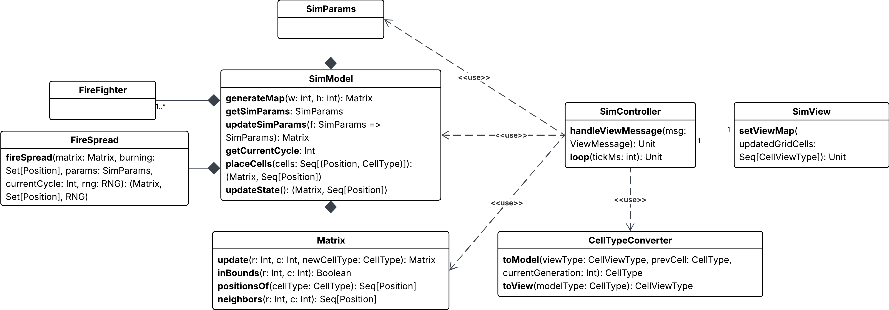
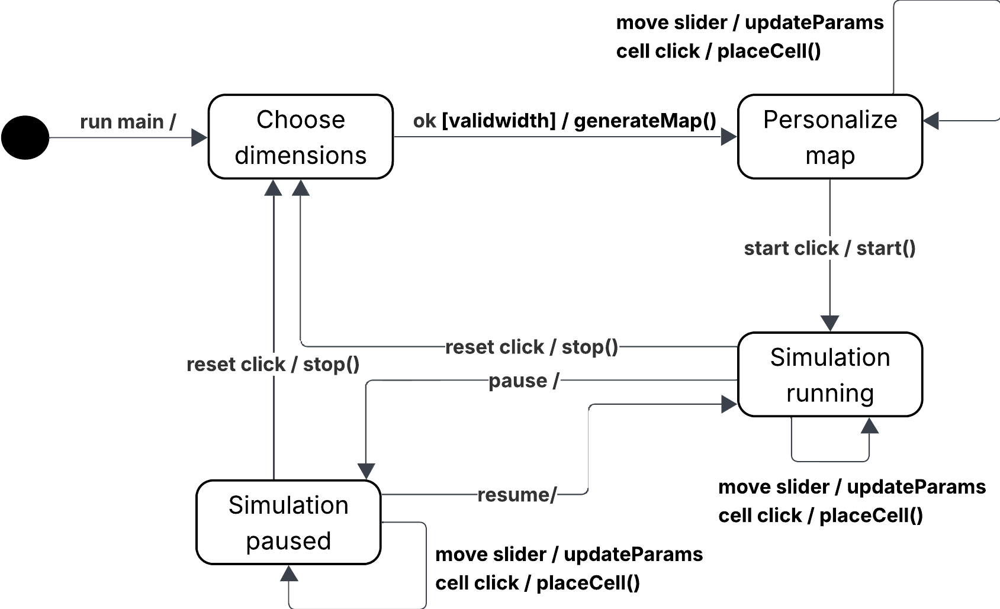
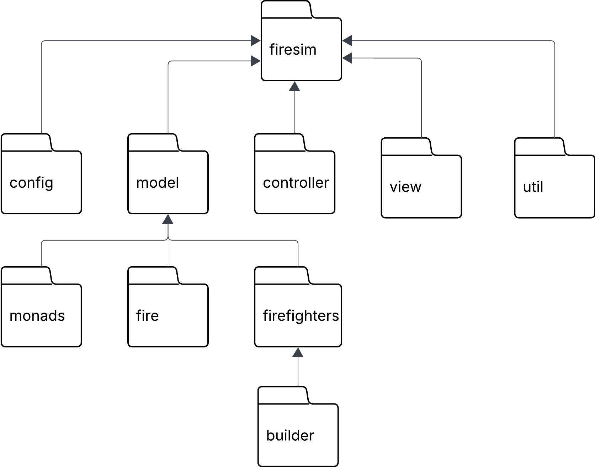

# Design di dettaglio
L'approccio progettuale utilizzato include principi tipici della programmazione funzionale:
- Utilizzo di strutture dati immutabili 
- Limitazione di side effects
- Valutazione lazy delle computazioni

Inoltre, sono presenti aspetti di programmazione object-oriented, come l'utilizzo di interfacce per catturare il contratto di componenti implementabili in molteplici modi.

Controller e model sono stati pensati per gestire in modo ottimale i vari stati della simulazione, mostrati nella figura sottostante. Vi è un primo stato in cui l'utente sceglie la dimensione della mappa tramite un dialog, successivamente si entra in una fase di modifica della mappa, in cui l'utente attraverso vari strumenti offerti dalla GUI può apportare modifiche alla mappa generata randomicamente. Al termine delle modifiche desiderate sarà possibile avviare la simulazione, e vi saranno controlli disponibili per metterla in pausa, riprenderla e resettarla. Sia nella fase di modifica che durante la simulazione l'utente avrà la possibilità di modificare celle e parametri.

## Controller
Il motore della simulazione è contenuto nella classe `SimController`, che gestisce il loop della simulazione. In questa classe sono mantenuti i parametri modificabili dall'utente tramite l'interfaccia grafica, come i parametri quali umidità, direzione e intensità del vento e temperatura. Nel momento in cui l'utente imposta le dimensioni della mappa il controller reagisce ordinando al model la generazione della mappa, che poi verrà renderizzata dalla view. L'utente, attraverso l'interfaccia grafica, può modificare celle della mappa dinamicamente, sia mentre la simulazione è in corso che nella fase precedente, utilizzata per definire la struttura della mappa. Ogni tipologia di cella è identificata da un'enumerazione sia nella view (`CellViewType`) che nel model (`CellType`), mantenute separate per garantire un isolamente tra view e model. Il controller, attraverso `CellTypeConverter` che si occupa di svolgere la conversione nel passaggio di informazioni tra view e model. Mentre la simulazione è in corso, il controller innesca aggiornamenti del model ad intervalli regolari; esso si occupa anche di ricevere e salvare temporaneamente gli input dell'utente, che verranno poi applicati all'aggiornamento successivo del model. Questo approccio alla ricezione di input permette di evitare inconsistenze dovute alla modifica di parametri nel model mentre un aggiornamento è in atto.

<!-- TODO: viene effettivamente  utilizzato? -->
L'input con la view è gestito tramite il trait `ViewMessage`, che attraverso il pattern `Command` permette alla view di gestire in modo uniforme la reazione ai diversi tipi di input, come la pressione di bottoni che mettono in pausa la simulazione, la resettano o modificano dei parametri.

## Model
La mappa della simulazione è rappresentata attraverso una matrice di `CellType`. Quando l'utente sceglie le dimensioni della mappa una prima mappa è generata casualmente, inserendo aree boschive, laghi, aree erbose e stazioni dei pompieri. L'algoritmo di generazione della mappa è definito nella classe `MapBuilder`, che attraverso il pattern builder permette di generare la mappa dividendo le varie fasi dell'algoritmo (come la generazione di laghi, foreste ed aree erbose) ed evitando di avere un unico metodo monolitico. Il pattern builder è applicato anche ai pompieri, che vengono creati specificando il raggio di azione e la stazione in cui sono posizionati separatamente.

Ogni ciclo di aggiornamento del model consiste in svariati passaggi:
- Aggiornamento dei parametri ricevuti dal controller
- Aggiornamento delle celle infuocate tramite l'algoritmo di diffusione del fuoco
- Aggiornamento della posizione dei vigili del fuoco e delle eventuali celle infuocate da loro spente

I pompieri sono modellati come record monadici immutabili tramite la type class `FireFighter`, che vengono aggiornati sulla base delle celle infuocate correnti. Vi è la possibilità che una cella infuocata sia circondata da altre celle che non possono prendere fuoco (come celle già bruciate); in questi casi i vigili del fuoco dovrebbero ignorarle per dirigersi verso celle circondate da altre a rischio di incendio. Per gestire questo edge case i vigili del fuoco considerano solo queste ultime nella decisione delle loro azioni.  

Ogni cella possiede una probabilità di prendere fuoco in base al tipo di `Vegetation` che è. Il fuoco è modellato in modo tale che siano presenti più stadi del fuoco rappresentati da `FireStage`. Il cuore del sistema della diffusione del fuoco, ad ogni ciclo calcola l'evoluzione della griglia. Ciò consiste come primo passaggio, il calcolare se una determinata cella in fiamme cambia stadio di fuoco, poi controllare se i vicini delle celle in fiamme se anche loro hanno prenso fuoco o meno.

## View
L'interfaccia grafica mostra la mappa della simulazione aggiornata in tempo reale, con celle colorate con diversi colori a seconda del loro tipo o dell'entità che vi è posizionata.
In particolare:
- Rosso per il fuoco
- Verde per le aree boschive
- Verde chiaro per le aree erbose
- Azzurro per i laghi
- Grigio per le celle bruciate
- Giallo per le stazioni dei pompieri
- Bordeaux per i pompieri

L'utente ha a disposizione vari controlli per gestire lo stato di avanzamento della simulazione, come i pulsanti per resettare, iniziare, fermare e riprendere una simulazione, e slider che permettono di modificare i parametri.

L'utente ha la possibiltà di modificare celle della mappa selezionando il tipo di cella da inserire tramite una scelta multipla (che cambia dinamicamente nel momento in cui si comincia la simulazione) e cliccando sulla cella interessata. 

Poiché l'applicazione prevede una fase iniziale di modifica della mappa, vi sono strumenti che permettono la modifica di molteplici celle della mappa, come uno strumento pennello per calorare le celle su cui passa il puntatore o uno strumento linea che permette di colorare una linea tra due punti, anche diagonale. 

## Pattern di progettazione

### Factory
Il pattern factory è stato utilizzato in quanto supportato facilmente dai companion object, tramite i quali è possibile creare istanze in modo idiomatico nascondendo la complessità del processo di creazione.

### Strategy
Il pattern strategy è stato utilizzando all'interno di `FireFighter` per separare l'algoritmo di movimento dal resto della classe.

### Builder
Il pattern builder è stato utilizzato per facilitare la creazione di `FireFighter` e la generazione della mappa nel `SimModel`.

### Command
Il pattern command è stato utilizzato nel controller per gestire la ricezione di input dalla view.

## Organizzazione del codice
Il codice è stato suddiviso in package raggruppando i sorgenti che implementano una stessa feature. La divisione scelta si può vedere nella figura sottostante.

[Indice](../index.md) |
[<](../3-architecture/index.md) |
[>](../5-implementation/index.md)
