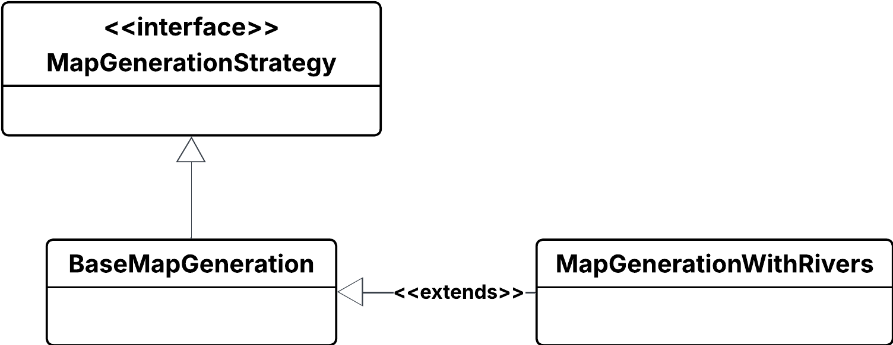

# Design di dettaglio
L'approccio progettuale utilizzato include principi tipici della programmazione funzionale:
- Utilizzo di strutture dati immutabili 
- Limitazione di side effects
- Valutazione lazy delle computazioni

Inoltre, sono presenti aspetti di programmazione object-oriented, come l'utilizzo di interfacce per catturare il contratto di componenti implementabili in molteplici modi.

Controller e model sono stati pensati per gestire in modo ottimale i vari stati della simulazione, mostrati nella figura sottostante. Vi è un primo stato in cui l'utente sceglie la dimensione della mappa tramite un dialog, successivamente si entra in una fase di modifica della mappa, in cui l'utente attraverso vari strumenti offerti dalla GUI può apportare modifiche alla mappa generata randomicamente. Al termine delle modifiche desiderate sarà possibile avviare la simulazione, e vi saranno controlli disponibili per metterla in pausa, riprenderla e resettarla. Sia nella fase di modifica che durante la simulazione l'utente avrà la possibilità di modificare celle e parametri.

## Controller

Il motore della simulazione è contenuto nella classe **`SimController`**, che gestisce il **main loop**.
In questa classe sono presenti i metodi che permettono all’utente, tramite l’interfaccia grafica, di modificare parametri come umidità, direzione e intensità del vento, temperatura.

Il cambiamento dei parametri avviene **istantaneamente nel model**, ma all’inizio di ogni avanzamento della simulazione il model salva una **copia** dei parametri, evitando possibili **inconsistenze**.
Quando l’utente imposta le **dimensioni della mappa**, il controller:
- ordina al model la **generazione** della mappa
- ordina alla view di **mostrarla**

L’utente può modificare le celle della mappa dinamicamente prima dell’inizio o durante il corso della simulazione.

Ogni tipologia di cella è identificata da un’enumerazione distinta:
- nella **view** con `CellViewType`
- nel **model** con `CellType`

Le due enumerazioni sono mantenute separate per garantire **isolamento**.
Il controller utilizza **`CellTypeConverter`** per la conversione delle informazioni tra view e model. 
Durante la simulazione, il controller:
- innesca aggiornamenti del model ad intervalli regolari
- riceve e mette in coda le modifiche alle celle effettuate dall’utente

Le celle modificate contenute nella coda vengono tutte notificate al model **prima dell’aggiornamento**, così da evitare **inconsistenze** mentre la simulazione avanza.

La comunicazione con la view avviene utilizzando il trait `ViewMessage`.
Grazie al `Command Pattern`, la view può gestire in modo uniforme diversi tipi di input, come pulsanti per mettere in pausa o resettare la simulazione, o modifiche dei parametri.
In questo modo, la view non chiama direttamente i metodi del controller, garantendo un disaccoppiamento chiaro e sicuro.

## Model
La mappa della simulazione è rappresentata attraverso una matrice di `CellType`.
Quando l'utente sceglie le dimensioni della mappa questa viene generata casualmente, inserendo aree boschive, rocciose, erbose, ma anche laghi, fiumi e stazioni dei vigili del fuoco.
L'algoritmo di generazione della mappa è definito nella classe `MapBuilder`, che attraverso il pattern builder permette di generare la mappa dividendo le varie fasi dell'algoritmo (come la generazione di laghi, foreste ed aree erbose) ed evitando di avere un unico metodo monolitico. 
Per ogni stazione presente nella mappa generata, vengono creati i vigili del fuoco specificando il raggio di azione e la stazione in cui sono posizionati separatamente, seguendo il pattern builder.

Ogni ciclo di aggiornamento del model consiste in svariati passaggi:
- Copia dei parametri di simulazione aggiornati dal controller
- Aggiornamento delle celle infuocate e autonomamente spente tramite l'algoritmo di diffusione del fuoco
- Aggiornamento della posizione dei vigili del fuoco e delle eventuali celle infuocate da loro spente

I vigili del fuoco sono modellati come record immutabili tramite la case class `FireFighter`, e vengono aggiornati sulla base delle celle infuocate correnti.
Vi è la possibilità che una cella infuocata sia circondata da altre celle che non possono prendere fuoco (come celle già bruciate); in questi casi i vigili del fuoco dovrebbero ignorarle per dirigersi verso celle circondate da altre a rischio di incendio.
`SimModel` aggiorna le istanze di `FireFighter` attraverso una computazione monadica che prende in input le celle infuocate, e restituisce in output le celle spente al passo corrente.

Ogni cella della griglia possiede una probabilità di accensione che dipende dal tipo di vegetazione associata(`Vegetation`).
La propagazione del fuoco è modellata tramite più stadi di combustione rappresentati dall’enumerazione `FireStage` che vanno a differenziare la probabilità di incendiare una cella adiacente. 

`SimModel` chiama poi la funzione `fireSpread`, che calcola l'evoluzione della diffusione del fuoco nella griglia.
Questo processo è suddiviso in due fasi principali:
- Aggiornamento delle celle in fiamme. Per ogni cella in combustione si verifica se la cella deve spegnersi attraverso l'utilizzo della `BurnDurationPolicy` che viene passata. Se la cella continua a bruciare, si controlla se può cambiare stadio di fuoco.
- Propagazione verso i vicini. Per ogni cella vengono analizzati i vicini e viene prima calcolata la loro probabilità di ignizione attraverso una funzione `ProbabilityCalc`. La probabilità base può essere arricchita dinamicamente con effetti aggiuntivi, come vento o vicinanza a corpi d’acqua in direzione del vento, grazie a funzioni decorator che estendono il comportamento senza modificare la funzione originale.

## View
L'interfaccia grafica mostra la mappa della simulazione aggiornata in tempo reale, convertendo i `CellViewType` offerti dal controller con celle colorate a seconda del tipo:
- Rosso per il fuoco
- Verde per le aree boschive
- Verde chiaro per le aree erbose
- Azzurro per i laghi
- Grigio per le celle bruciate
- Giallo per le stazioni dei vigili del fuoco
- Bordeaux per i vigili del fuoco

L'utente ha a disposizione vari controlli per gestire lo stato di avanzamento della simulazione, come i pulsanti per resettare, iniziare, fermare e riprendere una simulazione, e slider che permettono di modificare i parametri.

L'utente ha la possibilità di modificare celle della mappa selezionando il tipo di cella da inserire tramite una scelta multipla (che cambia dinamicamente nel momento in cui si comincia la simulazione) e cliccando sulla cella interessata. 

Poiché l'applicazione prevede una fase iniziale di modifica della mappa, vi sono strumenti che permettono la modifica di molteplici celle della mappa, come uno strumento pennello per colorare le celle su cui passa il puntatore o uno strumento linea che permette di colorare una linea tra due punti, anche diagonale. 

## Pattern di progettazione

### Strategy
Il pattern strategy è stato utilizzato:
 - All'interno di `FireFighter` per separare l'algoritmo di movimento dal resto della classe
 - In `FireSpread` per separare il calcolo della probabilità di ignizione e della durata di combustione di una cella dal resto dell'avanzamento della gestione del fuoco
 - In `SimModel` per separare l'algoritmo di generazione della mappa e per facilitare lo sviluppo di algoritmi diversi da quello base, come mostrato nell'UML di seguito:

### Builder
Il pattern builder è stato utilizzato:
 - Per facilitare la creazione di `FireFighter`
 - Per facilitare la generazione della mappa nel `SimModel`
 - Per comporre la funzione di calcolo della probabilità di ignizione di una cella

### Command
Il pattern command è stato utilizzato nel controller per gestire la ricezione di input dalla view.

### Decorator
Il pattern Decorator è stato utilizzato per estendere la strategia di base del calcolo della propagazione del fuoco, aggiungendo effetti supplementari.

## Organizzazione del codice
Il codice è stato suddiviso in package raggruppando i sorgenti che implementano una stessa feature. La divisione scelta si può vedere nella figura sottostante.

[Indice](../index.md) |
[<](../3-architecture/index.md) |
[>](../5-implementation/index.md)
