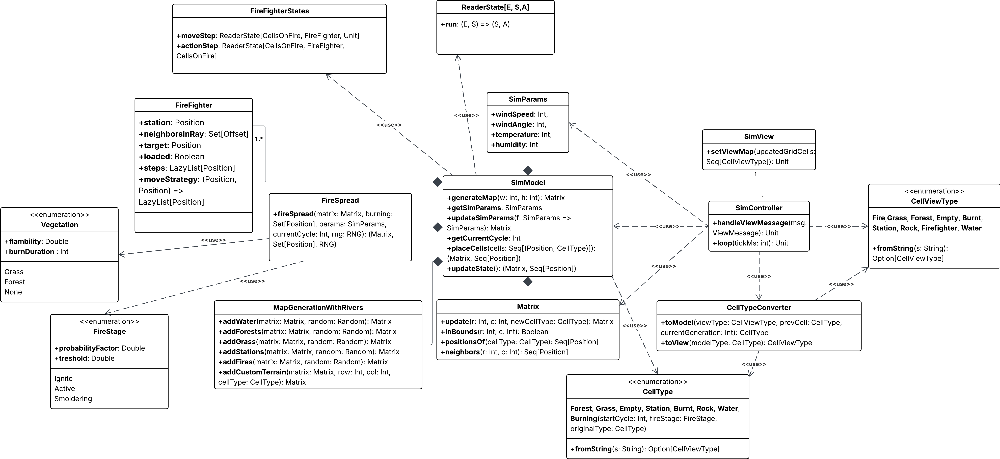
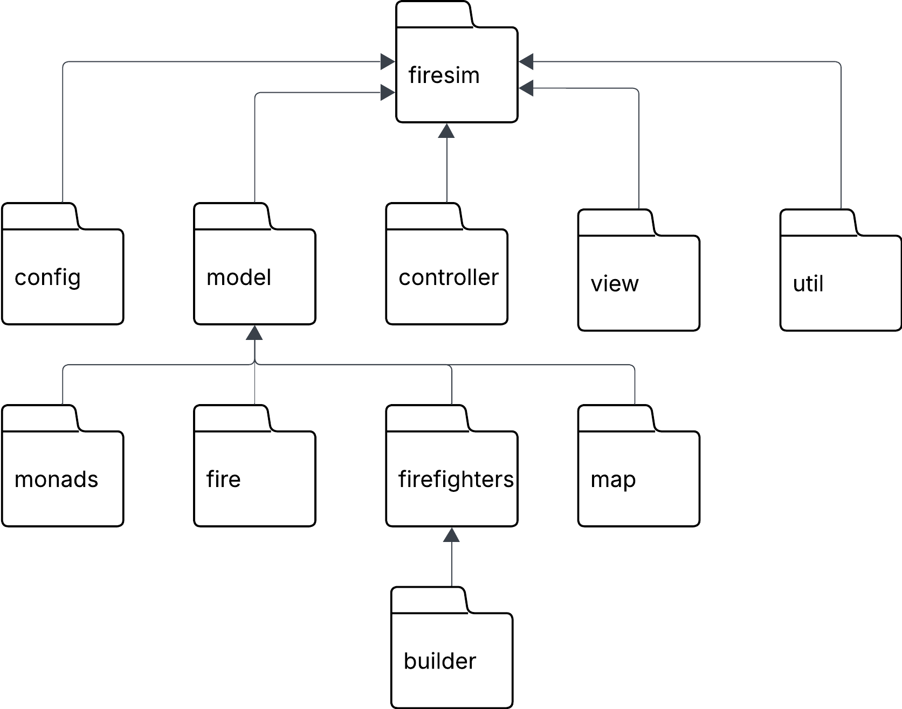

# Design di dettaglio
L'approccio progettuale utilizzato include principi tipici della programmazione funzionale:
- Utilizzo di strutture dati immutabili 
- Limitazione di side effects
- Valutazione lazy delle computazioni

Inoltre, sono presenti aspetti di programmazione object-oriented, come l'utilizzo di interfacce per catturare il contratto di componenti implementabili in molteplici modi.

## Model

## Controller

## View

## Pattern di progettazione

### Factory
Il pattern factory è stato utilizzato in quanto supportato facilmente dai companion object, tramite i quali è possibile creare istanze in modo idiomatico nascondendo la complessità del processo di creazione.

### Strategy
Il pattern strategy è stato utilizzando all'interno di `FireFighter` per separare l'algoritmo di movimento dal resto della classe.

### Builder
Il pattern builder è stato utilizzato per facilitare la creazione di `FireFighter` e la generazione della mappa nel `SimModel`.

## Organizzazione del codice
Come mostrato in figura, il codice è stato suddiviso in package seguendo la divisione di responsabilità

[Indice](../index.md) |
[<](../3-architecture/index.md) |
[>](../5-implementation/index.md)
